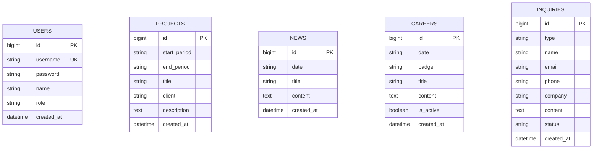

# 🚀 ENCOCNS 백엔드 개발 학습 로드맵

## 1. 개요
본 문서는 ENCOCNS 웹 사이트(React + Vite)의 하드코딩된 JSON 데이터를 실제 백엔드 API 및 데이터베이스(DB) 시스템으로 전환하기 위한 학습용 백엔드 개발 로드맵입니다.

---

## 2. 백엔드 기술 스택 추천

### 옵션 A (추천/빠른 학습)
- **Framework**: Node.js (Express 또는 NestJS) + TypeScript
- **장점**: 프론트엔드가 TypeScript 기반이므로 DTO/타입 모델 공유가 수월하고 가볍게 시작할 수 있음

### 옵션 B (기업형/금융권 표준)
- **Framework**: Java + Spring Boot 3.x + Spring Data JPA
- **장점**: 엔코씨엔에스의 주력 분야인 금융/엔터프라이즈 IT 시스템 개발 표준 스택

### 데이터베이스 (Database)
- **RDBMS**: PostgreSQL 또는 MySQL / MariaDB
- **ORM**: Prisma / TypeORM (Node.js) 또는 Spring Data JPA (Java)

---

## 3. 데이터베이스(DB) 테이블 설계 (ERD)

---

## 4. RESTful API 명세서 설계

### 🌐 공개 프론트엔드 API (인증 불필요)
- `GET /api/projects` : 구축 사례 및 프로젝트 목록 조회
- `GET /api/news` : 뉴스/보도자료 목록 조회
- `GET /api/news/:id` : 뉴스 상세 조회
- `GET /api/careers` : 채용 공고 목록 조회
- `GET /api/careers/:id` : 채용 공고 상세 조회
- `POST /api/inquiries` : 고객 문의하기 등록
- `POST /api/careers/:id/apply` : 입사 지원서 제출 (파일 업로드)

### 🔐 어드민 전용 API (JWT 인증 필요)
- `POST /api/admin/auth/login` : 관리자 로그인 (JWT 발급)
- `GET /api/admin/projects` : 프로젝트 관리 목록
- `POST /api/admin/projects` : 프로젝트 등록
- `PUT /api/admin/projects/:id` : 프로젝트 수정
- `DELETE /api/admin/projects/:id` : 프로젝트 삭제
- `GET /api/admin/news` : 뉴스 관리 목록
- `POST /api/admin/news` : 뉴스 등록
- `PUT /api/admin/news/:id` : 뉴스 수정
- `DELETE /api/admin/news/:id` : 뉴스 삭제
- `GET /api/admin/careers` : 채용 관리 목록
- `POST /api/admin/careers` : 채용 공고 등록
- `PUT /api/admin/careers/:id` : 채용 공고 수정
- `DELETE /api/admin/careers/:id` : 채용 공고 삭제
- `GET /api/admin/inquiries` : 고객 문의 내역 목록
- `PATCH /api/admin/inquiries/:id/status` : 문의 처리 상태 변경 (접수완료/답변완료 등)
- `GET /api/admin/users` : 어드민 사용자 목록
- `POST /api/admin/users` : 어드민 사용자 생성
- `DELETE /api/admin/users/:id` : 어드민 사용자 삭제

---

## 5. 단계별 실행 로드맵 (Phase 1 ~ 6)

### 📌 Phase 1. 개발 환경 설정 & DB 구축
- [ ] 선택한 프레임워크(Express / NestJS / Spring Boot) 프로젝트 초기화
- [ ] PostgreSQL / MySQL 설치 (Docker 활용 추천)
- [ ] ORM(Prisma/JPA)을 통한 5개 테이블 데이터베이스 마이그레이션 실행
- [ ] 기존 `src/data/*.json` 데이터를 DB에 이관하는 Seed 스크립트 작성

### 📌 Phase 2. 공개(Public) CRUD API 구현
- [ ] 프로젝트, 뉴스, 채용 공고를 조회하는 `GET` API 구현
- [ ] 고객 문의하기 접수 `POST` API 구현
- [ ] Swagger(OpenAPI)를 통한 API 문서화 및 동작 테스트

### 📌 Phase 3. 어드민 인증(Auth) 및 보안 적용
- [ ] 비밀번호 암호화 저장 (`bcrypt`)
- [ ] 로그인 성공 시 `JWT (JSON Web Token)` 발급 기능 구현
- [ ] JWT 검증 미들웨어를 통해 `/api/admin/*` 경로 보호
- [ ] CORS(Cross-Origin Resource Sharing) 설정 적용 (프론트엔드 출처 허용)

### 📌 Phase 4. 프론트엔드 연동 (localStorage 대체)
- [ ] 프론트엔드 프로젝트에 `axios` 도입
- [ ] `src/services/api.ts` 계층을 신설하여 백엔드 REST API 호스팅 주소 연결
- [ ] Axios Interceptor를 작성하여 어드민 요청 시 `Authorization: Bearer <token>` 자동 전송

### 📌 Phase 5. 고도화 기능 구현
- [ ] **파일 업로드**: 입사 지원서(PDF/DOCX) 파일 업로드 기능 구현 (`multer` / Spring Multipart)
- [ ] **페이지네이션(Pagination)**: 데이터가 많을 경우를 대비한 목록 페이징 처리 (`page`, `limit`)
- [ ] **전역 예외 처리(Global Error Handling)**: 에러 발생 시 일관된 JSON 데이터 포맷 응답

### 📌 Phase 6. 배포 및 인프라
- [ ] Dockerfile 작성하여 애플리케이션 컨테이너화
- [ ] Render, Railway, Fly.io 또는 AWS/Vercel을 통한 백엔드 서버 및 DB 라이브 배포
